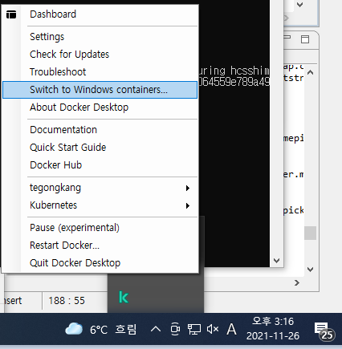

[커리큘럼](https://docs.google.com/document/d/1ljuFZOB4tCthQFEVqvcUm5fkb6H2cPjUxnDQe9T5mTQ/edit?usp=sharing)


## 01 django with docker

**클린 코드 가이드 & Tip**

- [Dockerfile은 마구 작성해서는 안된다](https://docs.docker.com/develop/develop-images/dockerfile_best-practices/)
- 흔히 헷갈리는 개념 : Dockerfile의 `ADD` vs `COPY`
- 팁 : docker 명령어 입력할 때 굳이 전부 입력할 필요 없다

```
$ docker images
REPOSITORY                 TAG       IMAGE ID       CREATED       SIZE
02_01_django_mariadb_app   latest    46f7e3776c9c   5 days ago    989MB
<none>                     <none>    8ae8f1d746f1   5 days ago    989MB
<none>                     <none>    b7494d4b5487   5 days ago    989MB
mariadb                    10        e2278f24ac88   3 weeks ago   410MB

$ docker rmi -f 46f     # 46f7e3776c9c의 일부만 입력해도 잘 동작한다
Untagged: 02_01_django_mariadb_app:latest
Deleted: sha256:46f7e3776c9cb6285ef5d8386b867c470df8b069d6384645933cccd7ba711de9

$ docker images
REPOSITORY   TAG       IMAGE ID       CREATED       SIZE
<none>       <none>    8ae8f1d746f1   5 days ago    989MB
<none>       <none>    b7494d4b5487   5 days ago    989MB
mariadb      10        e2278f24ac88   3 weeks ago   410MB


$ docker ps -a
CONTAINER ID   IMAGE          COMMAND                  CREATED      STATUS                    PORTS     NAMES
603b9f541bc0   46f7e3776c9c   "/bin/sh -c ./docker??   5 days ago   Exited (137) 5 days ago             django
e71ff3faac40   mariadb:10     "docker-entrypoint.s??   5 days ago   Exited (0) 5 days ago               db_mysql

$ docker logs 603       # 603b9f541bc0의 일부만 입력해도 잘 동작한다
2021/12/02 02:05:00 Waiting for: tcp://db:5432
2021/12/02 02:05:10 Problem with dial: dial tcp: lookup db on 127.0.0.11:53: read udp 127.0.0.1:45616->127.0.0.11:53: i/o timeout. Sleeping 1s
2021/12/02 02:05:20 Timeout after 20s waiting on dependencies to become available: [tcp://db:5432]
Apply database migrations
Operations to perform:
  Apply all migrations: admin, auth, contenttypes, sessions
Running migrations:
  No migrations to apply.
Start server
Watching for file changes with StatReloader
[02/Dec/2021 02:05:33] "GET / HTTP/1.1" 200 10697
```

- 팁 : docekr-entrypoint.sh

## 02_01 django mariadb

가장 중요한 개념 : dockerize

- 1주차 때 설명했듯 실제 백엔드를 개발할 때는 절대 다수가 컨테이너로 운용한다
- django 컨테이너는 mysql 컨테이너 직후 올라와야 하지만, 이 순서를 보장할 수 있을까?
- *컨테이너 순서는 보장할 수 있지만, 서비스의 순서는 보장할 수 없다!* 그래서 사용하는 것이 dockerize 

```
...

ENV DOCKERIZE_VERSION v0.6.1
RUN wget https://github.com/jwilder/dockerize/releases/download/$DOCKERIZE_VERSION/dockerize-linux-amd64-$DOCKERIZE_VERSION.tar.gz \
    && tar -C /usr/local/bin -xzvf dockerize-linux-amd64-$DOCKERIZE_VERSION.tar.gz \
    && rm dockerize-linux-amd64-$DOCKERIZE_VERSION.tar.gz

...

ENTRYPOINT ["dockerize", "-wait", "tcp://db_mysql:3306", "-timeout", "20s"]
```

**클린 코드 가이드 & Tip**
- [django 비밀 변수 관리 env 파일 관리법](https://velog.io/@jisoo1170/django-%EB%B9%84%EB%B0%80-%EA%B0%92-%EA%B4%80%EB%A6%AC%ED%95%98%EA%B8%B0)
- settings.py 이원화   
실무에서는 local용 settings.py와 prodcution용 settings.py로 이원화하여 운영한다   
추가 실습: local_settings.py 에서는 sqlite를 사용하고, production_settings.py는 mariadb (mysql) 사용하기
- 패키지 관리 기법  
`pip freeze > requirements.txt`로 생성하는 requirements.txt는 가장 대중적인 패키지 관리 기법이지만 최선의 방법은 아니다. pipenv 혹은 poetry를 사용할 것을 권장한다.
[참고 영상](https://www.youtube.com/watch?v=y2kqs4d-Wf0)

## 02_02 deploy with nginx

가장 중요한 개념 : nginx 설정

## 03 django with mariadb & nginx

02_01과 02_2 개념을 조합하여 `docker-compose build` & `docker compose up`으로 배포가 가능하게 한다.

여기까지 실습한 수강생들은 매우 쉽게 CI/CD(github action) & 배포 실습을 따라올 수 할 수 있다.

## 04 django rest framework

가장 중요한 개념 
 - DB 설계  
1. ABLY로부터 데이터를 받아 우선 데이터베이스를 만든다.
2. 테이블을 수강생들에게 설명한다.
3. ABLY 앱을 보여준다.
4. ABLY 앱의 기능을 구현하기 위한 API를 함께 논의해본다. (아래 예시 참조)
5. 해당 API를 구현하기 위해 테이블간의 관걔는 어떻게 설계해야 하는지 납득시킨다.
6. 해당 테이블 관계를 구현하는 과정에서 반드시 역참조가 들어간다.

```
(예시)
GET : /products/
POST : /products/
GET : /company/
GET: /company/products	역참조

미션
GET : /products/reviews
POST : /products/reviews
```
- DB 역참조     
 models.py의 `related_name` 혹은 `_set`으로 ForienKey 역참조를 할 수 있다.

- 다중 이미지  
에이블리 앱을 보면 상품 정보에 여러 개의 이미지가 있다.
이 여러 개의 이미지를 하나 하나 모델 column으로 만들지 말 것. ProductImage 테이블과 Product 테이블의 관계로 해결할 것.

- Two Models in One Serializer - 반드시 실습
create, update 함수 덮어쓰기 (Product Create시 ProductImage 함께 Create 실습)


**클린 코드 가이드 & Tip**

- [중요한 팁 - 이 문서는 수강생들이 모두 끝까지 읽어야 함](https://www.django-rest-framework.org/api-guide/relations/)
- 팁: drf_writable_nested & WritableNestedModelSerializer  
Two Models in One Serializer 실습할 때 소개만 해주기
단, 이 라이브러리는 사용에 한계가 있으므로, create, update 덮어쓰기 실습을 더 강조할 것.
- 팁: postman으로 API 테스팅

## 흔히 발생하는 오류 

1. Windows Docker 사용 중 아래와 같은 오류가 발생하는 경우


```
The command '/bin/bash -c pip install -r requirements.txt' returned a non-zero code: 4294967295: failed to shutdown container: 
...
```

아래와 같이 Windonws Container를 Linux Container로 변경한다.





## ElasticSearch for Django Official Documentaion

[참고 자료](src/django-rest-elasticsearch-readthedocs-io-en-latest.pdf) 